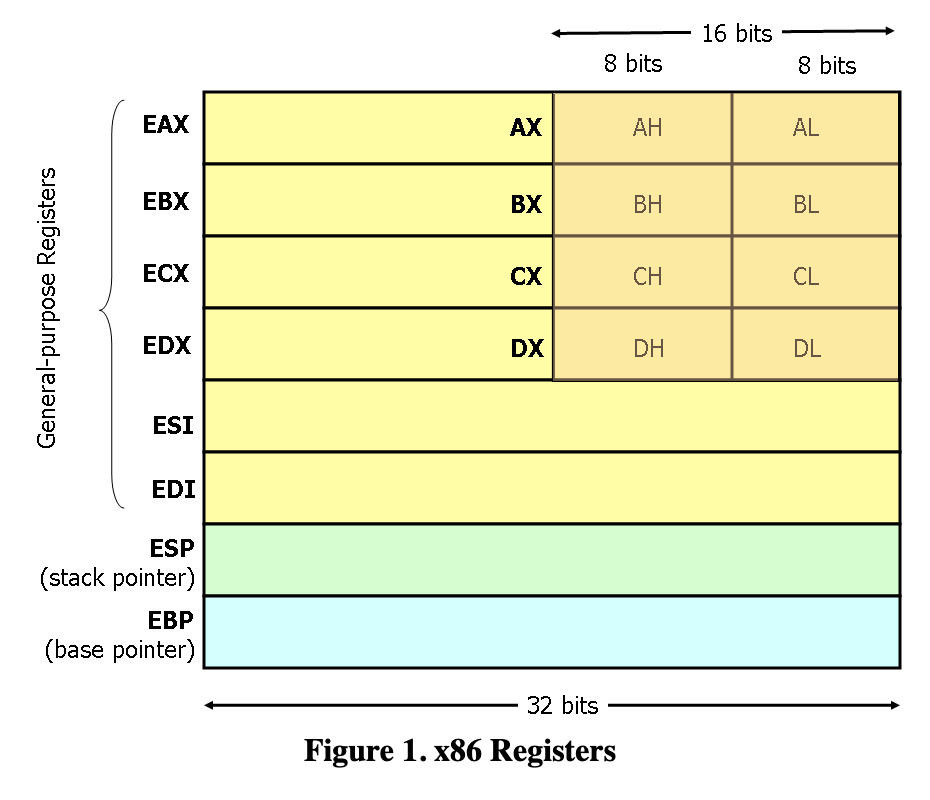
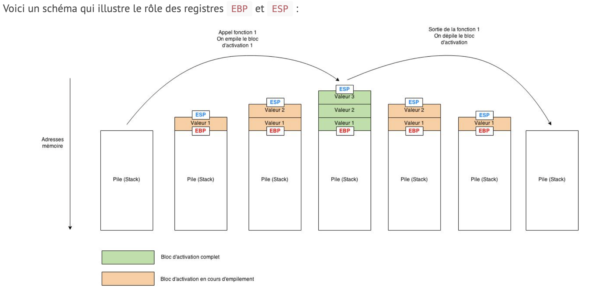

# Rainfall

## Installation PEDA:
1. Download the repo as a zip and unzip it
2. [VM]    `cd /tmp && mkdir peda && mkdir peda/lib`
3. [LOCAL] `scp -P 4242 ../../Downloads/peda-master/* level0@192.168.56.3:/tmp/peda`
4. [LOCAL] `scp -P 4242 ../../Downloads/peda-master/lib/* level0@192.168.56.3:/tmp/peda/lib`
5. [VM]    `cd /tmp && echo "source /tmp/peda/peda.py" >> .gdbinit`
5. [VM]    `gdb /home/user/level0/level0`

## La Pile

**EAX, EBX, ECX, EDX:** appelés Accumulateur, Base, Compteur, Données ont pour rôle de stocker des données temporaires pour le processeur lorsqu’il exécute un programme.

**ESP, EBP, ESI, EDI:** appelés Pointeur de Pile (Stack), Pointeur de Base, Index de Source et Index de Destination sont plutôt utilisés en tant que pointeurs et index, comme leur nom l’indique. La stack frame courante se situe entre l’adresse contenue dans EBP et l’adresse contenue dans ESP:
- ebp: l’adresse du début de la stack frame.
- esp: l'adresse du haut de la pile (donc l’adresse la plus basse).

**EIP:** appelé Pointeur d’Instruction; il contient l’adresse de la prochaine instruction que le processeur doit exécuter.

**EFALGS:** contient des indicateurs, des interrupteurs, des drapeaux (flags) essentiellement utilisés pour des comparaisons, mais pas uniquement.
